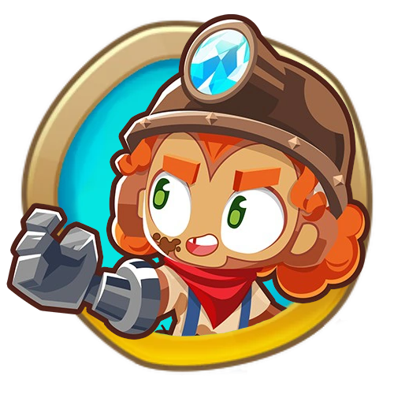

<h1 align="center">

Bonnie Hero Mod
</h1>

A project aiming to port Bonnie from BTD Battles 2 over to BTD 6 and make rebalance her for the different environment. Made with help of GrahamKracker & DatJaneDoe.

